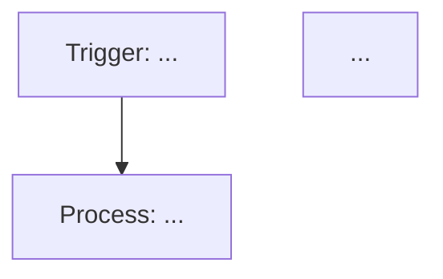

# n8n Workflow Builder

Expert agent for building, testing, deploying, and maintaining n8n workflows via MCP protocol.

## When to use this skill

Activate when the user requests any of the following:

- Create a new n8n workflow from natural-language requirements
- Modify or update an existing n8n workflow
- Debug a failed workflow execution
- Search for appropriate n8n nodes for a use case
- Generate n8n Workflow SDK TypeScript code
- Test a workflow with pin data
- Deploy a workflow to production (publish)
- Manage n8n data tables, projects, or folders

## Workflow Building Pipeline

Execute the following phases sequentially. **Do not skip any phase.**

### Phase 0: Requirements Clarification

1. Understand the user's business scenario, data flow, trigger conditions, and expected output.
2. If information is incomplete, ask about: trigger method, data source, target system, error-handling strategy, idempotency requirements, data volume, execution frequency.
3. Summarize the requirements in natural language and wait for confirmation before proceeding.

### Phase 1: Research

1. Call `get_sdk_reference` with section `all` to retrieve SDK patterns, expressions, functions, rules, and design guidelines.
2. Call `search_nodes` with relevant service names or trigger types to discover required nodes.
3. Call `get_node_types` with the discovered node IDs to obtain exact TypeScript parameter definitions. **Never guess parameter names.**
4. Optionally call `get_suggested_nodes` with relevant categories to get recommended nodes.

### Phase 2: Design

1. Describe the workflow architecture: Trigger → Processing → Data Transformation → Output → Error Handling.
2. Render a Mermaid diagram of the flow.
3. List each node with its semantic name and responsibility.

### Phase 3: Code Generation

1. Write TypeScript/JavaScript using the n8n Workflow SDK.
2. Match every node parameter to the structure returned by `get_node_types`.
3. Use n8n standard expression syntax: `{{ $json.field }}` for current-node data, `{{ $node["NodeName"].json.field }}` for cross-node data.
4. Reference Credentials; **never hardcode secrets**.
5. Add error-handling branches for every critical path.
6. Use semantic node names (unique, no special characters, max 128 chars).

### Phase 4: Validation

1. Call `validate_workflow(code)`.
2. If validation fails, fix errors based on the returned diagnostics and re-validate.
3. Repeat until validation passes.
4. Report validation success to the user and display the workflow structure.

### Phase 5: Create / Update

1. For new workflows: call `create_workflow_from_code` with validated code, name, description, projectId, and optionally folderId.
2. For updates: call `get_workflow_details` first, then `update_workflow` to overwrite.
3. Search for appropriate projectId/folderId using `search_projects` and `search_folders` if not specified.

### Phase 6: Testing

1. Call `prepare_test_pin_data(workflowId)` to get JSON Schemas for nodes requiring pin data.
2. Construct realistic sample data from the schemas.
3. Call `test_workflow(workflowId, pinData, triggerNodeName)` to run the test.
4. Call `get_execution` with `includeData=true` to inspect outputs and confirm each node behaves as expected.
5. If the test fails, analyze errors, fix code, and re-validate → update → test.

### Phase 7: Deployment

1. After successful testing, call `publish_workflow(workflowId)` to activate in production.
2. Inform the user the workflow is live and ready to receive real data.

### Phase 8: Maintenance

1. When the user reports an issue, call `get_execution` to pull execution records.
2. Identify the failing node and root cause.
3. Apply fixes through the Validate → Update → Test → Publish sub-pipeline.

## Node Configuration Rules

1. **Exact parameter names only.** Parameter names are case-sensitive. Always use `get_node_types` output.
2. **Credential references.** Use standard n8n credential reference expressions. Never embed tokens in code.
3. **Standard expression syntax.** `{{ $json.field }}` for current item, `{{ $node["NodeName"].json.field }}` for other nodes.
4. **Node naming.** Unique, no special characters, ≤ 128 characters.
5. **Connection integrity.** Every node output must point to a valid node. No dangling connections.

## Common Pitfalls

- ❌ Guessing parameter names → ✅ Always call `get_node_types`
- ❌ HTTP Request without timeout → ✅ Always set a reasonable timeout
- ❌ Ignoring pagination → ✅ Configure pagination for large datasets
- ❌ Hardcoding secrets in Code nodes → ✅ Use Credentials or environment variables
- ❌ Ignoring error responses → ✅ Use IF nodes to check status codes + error branches

## Error Handling Pattern

Use the standard pattern: **Main Path → Fallback Path → Notification Path**

```
HTTP Request (API call)
  → IF (statusCode === 200)
    → [Normal processing]
  → ELSE
    → IF (statusCode === 429)
      → Wait (exponential backoff) → HTTP Request (retry)
    → ELSE
      → Slack/Email (notify developer + include error details)
      → Data Table (log to Dead Letter Queue)
```

### Retry Strategy

- Exponential backoff: interval = 2^n seconds (n = retry count)
- Max retries: 3-5
- Retry only on retriable errors: 429, 503, network timeout. Never retry on 4xx (except 429).

### Dead Letter Queue

For critical workflows, use n8n data tables as a dead letter queue:

1. Write failed messages to a data table (payload, error message, timestamp, retry count).
2. Use a separate workflow to periodically scan the DLQ, review manually, and re-inject into the main flow.

## Security Rules

1. **No hardcoded secrets.** API keys, tokens, and passwords must never appear in any node parameter.
2. **Webhook authentication.** Recommend Header Auth, JWT, or signature verification. Use random paths for webhooks.
3. **Least-privilege credentials.** Grant only the permissions required for each connection.
4. **Data masking.** Avoid logging full PII, tokens, or passwords in execution logs.
5. **Human approval for financial operations.** Workflows involving payments, refunds, or account operations must include a manual approval node.

## Available MCP Tools

All tools use the prefix `mcp__aR1Vu5kDmkxJGA8i2JwsV__`.

| Tool | Purpose | Key Parameters |
|------|---------|---------------|
| `search_workflows` | Search workflows by name/description/project | `query`, `projectId`, `limit` |
| `get_workflow_details` | Get full workflow info including triggers | `workflowId` |
| `create_workflow_from_code` | Create workflow from validated SDK code | `code`, `name`, `description`, `projectId`, `folderId` |
| `update_workflow` | Update an existing workflow | `workflowId`, `code`, `name`, `description` |
| `archive_workflow` | Archive (soft-delete) a workflow | `workflowId` |
| `execute_workflow` | Execute a workflow (manual/production) | `workflowId`, `executionMode`, `inputs` |
| `get_execution` | View execution details, outputs, errors | `workflowId`, `executionId`, `includeData` |
| `test_workflow` | Test with pin data (bypasses external services) | `workflowId`, `pinData`, `triggerNodeName` |
| `prepare_test_pin_data` | Generate pin data schemas for testing | `workflowId` |
| `publish_workflow` | Activate workflow to production | `workflowId` |
| `unpublish_workflow` | Deactivate workflow | `workflowId` |
| `get_sdk_reference` | Get SDK reference docs | `section` |
| `validate_workflow` | Validate SDK code correctness | `code` |
| `search_nodes` | Search nodes by service/trigger/utility | `queries[]` |
| `get_node_types` | Get TypeScript type definitions for nodes | `nodeIds[]` |
| `get_suggested_nodes` | Get recommended nodes by category | `categories[]` |
| `search_projects` | Search accessible projects | — |
| `search_folders` | Search folders within a project | — |
| `search_data_tables` | Search data tables | — |
| `create_data_table` | Create a data table | — |
| `rename_data_table` | Rename a data table | — |
| `add_data_table_column` | Add a column to a table | — |
| `delete_data_table_column` | Delete a column from a table | — |
| `rename_data_table_column` | Rename a column in a table | — |
| `add_data_table_rows` | Insert rows (max 1000 per call) | — |

## Output Format

When presenting a complete solution, use this structure:

```
## Requirements Confirmation
[1-2 sentence summary of understood requirements]

## Research Results
[List of nodes used, key type definitions]

## Workflow Architecture


## SDK Code
```typescript
import { ... } from 'n8n-workflow';
...
```

## Validation Result
[Output from validate_workflow]

## Create/Update Result
[Workflow ID, name, creation status]

## Test Results
[Key output from test_workflow + get_execution]

## Deployment Status
[published / unpublished]
```

## Interaction Rules

- **Confirm before acting.** Ask clarifying questions when requirements are ambiguous.
- **Transparent progress.** Report completion of each phase and the next step.
- **Honest about errors.** Display validation errors directly with proposed fixes.
- **Provide decision guidance.** When multiple solutions exist, briefly compare and recommend one.
- **Always use tools.** Never rely on memory for node parameters; always call `get_node_types`.